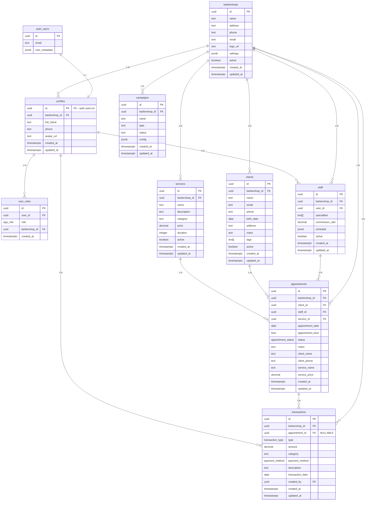

# 🔗 Relacionamentos do Banco de Dados BarberSmart

## Diagrama de Relacionamentos



## Detalhamento dos Relacionamentos

### 1. **auth.users → profiles** (1:1)
- **Descrição**: Cada usuário autenticado tem exatamente um perfil
- **Foreign Key**: `profiles.id → auth.users.id`
- **Constraint**: ON DELETE CASCADE
- **Criação**: Automática via trigger `on_auth_user_created`

### 2. **profiles → user_roles** (1:N)
- **Descrição**: Um perfil pode ter múltiplas roles em diferentes barbearias
- **Foreign Key**: `user_roles.user_id → profiles.id`
- **Constraint**: 
  - ON DELETE CASCADE
  - UNIQUE (user_id, role, barbershop_id)

### 3. **barbershops → profiles** (1:N)
- **Descrição**: Uma barbearia tem múltiplos perfis de usuários
- **Foreign Key**: `profiles.barbershop_id → barbershops.id`
- **Constraint**: ON DELETE SET NULL (usuário pode existir sem barbearia)

### 4. **barbershops → clients** (1:N)
- **Descrição**: Uma barbearia tem múltiplos clientes
- **Foreign Key**: `clients.barbershop_id → barbershops.id`
- **Constraint**: 
  - ON DELETE CASCADE
  - NOT NULL

### 5. **barbershops → services** (1:N)
- **Descrição**: Uma barbearia oferece múltiplos serviços
- **Foreign Key**: `services.barbershop_id → barbershops.id`
- **Constraint**: 
  - ON DELETE CASCADE
  - NOT NULL

### 6. **barbershops → staff** (1:N)
- **Descrição**: Uma barbearia tem múltiplos membros na equipe
- **Foreign Key**: `staff.barbershop_id → barbershops.id`
- **Constraint**: 
  - ON DELETE CASCADE
  - NOT NULL
  - UNIQUE (barbershop_id, user_id)

### 7. **profiles → staff** (1:N)
- **Descrição**: Um perfil (usuário) pode ser staff em múltiplas barbearias
- **Foreign Key**: `staff.user_id → profiles.id`
- **Constraint**: 
  - ON DELETE CASCADE
  - NOT NULL

### 8. **barbershops → appointments** (1:N)
- **Descrição**: Uma barbearia tem múltiplos agendamentos
- **Foreign Key**: `appointments.barbershop_id → barbershops.id`
- **Constraint**: 
  - ON DELETE CASCADE
  - NOT NULL

### 9. **clients → appointments** (1:N)
- **Descrição**: Um cliente tem múltiplos agendamentos
- **Foreign Key**: `appointments.client_id → clients.id`
- **Constraint**: 
  - ON DELETE RESTRICT (não pode deletar cliente com agendamentos)
  - NOT NULL

### 10. **staff → appointments** (1:N)
- **Descrição**: Um membro da equipe atende múltiplos agendamentos
- **Foreign Key**: `appointments.staff_id → staff.id`
- **Constraint**: 
  - ON DELETE RESTRICT (não pode deletar staff com agendamentos)
  - NOT NULL

### 11. **services → appointments** (1:N)
- **Descrição**: Um serviço está em múltiplos agendamentos
- **Foreign Key**: `appointments.service_id → services.id`
- **Constraint**: 
  - ON DELETE RESTRICT (não pode deletar serviço com agendamentos)
  - NOT NULL

### 12. **barbershops → transactions** (1:N)
- **Descrição**: Uma barbearia tem múltiplas transações
- **Foreign Key**: `transactions.barbershop_id → barbershops.id`
- **Constraint**: 
  - ON DELETE CASCADE
  - NOT NULL

### 13. **appointments → transactions** (1:N)
- **Descrição**: Um agendamento pode gerar múltiplas transações (pagamento, comissão, etc)
- **Foreign Key**: `transactions.appointment_id → appointments.id`
- **Constraint**: 
  - ON DELETE SET NULL
  - **NULLABLE** (transações podem existir sem agendamento, ex: despesas gerais)

### 14. **profiles → transactions** (1:N)
- **Descrição**: Rastreia quem criou cada transação
- **Foreign Key**: `transactions.created_by → profiles.id`
- **Constraint**: 
  - ON DELETE SET NULL
  - NOT NULL

### 15. **barbershops → campaigns** (1:N)
- **Descrição**: Uma barbearia tem múltiplas campanhas de marketing
- **Foreign Key**: `campaigns.barbershop_id → barbershops.id`
- **Constraint**: 
  - ON DELETE CASCADE
  - NOT NULL

## Indexes Recomendados

Para otimizar as queries mais comuns:

```sql
-- Profiles
CREATE INDEX idx_profiles_barbershop_id ON profiles(barbershop_id);

-- User Roles
CREATE INDEX idx_user_roles_user_id ON user_roles(user_id);
CREATE INDEX idx_user_roles_barbershop_id ON user_roles(barbershop_id);

-- Clients
CREATE INDEX idx_clients_barbershop_id ON clients(barbershop_id);
CREATE INDEX idx_clients_phone ON clients(phone);

-- Services
CREATE INDEX idx_services_barbershop_id ON services(barbershop_id);
CREATE INDEX idx_services_active ON services(barbershop_id, active);

-- Staff
CREATE INDEX idx_staff_barbershop_id ON staff(barbershop_id);
CREATE INDEX idx_staff_user_id ON staff(user_id);
CREATE INDEX idx_staff_active ON staff(barbershop_id, active);

-- Appointments
CREATE INDEX idx_appointments_barbershop_id ON appointments(barbershop_id);
CREATE INDEX idx_appointments_client_id ON appointments(client_id);
CREATE INDEX idx_appointments_staff_id ON appointments(staff_id);
CREATE INDEX idx_appointments_service_id ON appointments(service_id);
CREATE INDEX idx_appointments_date ON appointments(appointment_date);
CREATE INDEX idx_appointments_date_staff ON appointments(staff_id, appointment_date);
CREATE INDEX idx_appointments_status ON appointments(barbershop_id, status);

-- Transactions
CREATE INDEX idx_transactions_barbershop_id ON transactions(barbershop_id);
CREATE INDEX idx_transactions_appointment_id ON transactions(appointment_id);
CREATE INDEX idx_transactions_created_by ON transactions(created_by);
CREATE INDEX idx_transactions_date ON transactions(transaction_date);
CREATE INDEX idx_transactions_type ON transactions(barbershop_id, type);

-- Campaigns
CREATE INDEX idx_campaigns_barbershop_id ON campaigns(barbershop_id);
CREATE INDEX idx_campaigns_status ON campaigns(barbershop_id, status);
```

## Regras de Integridade

### Deleção em Cascata
- Deletar **barbershop** → deleta clients, services, staff, appointments, transactions, campaigns
- Deletar **auth.users** → deleta profile → deleta user_roles, staff
- Deletar **profile** → deleta user_roles, staff

### Deleção Restrita (RESTRICT)
- Não pode deletar **client** com appointments ativos
- Não pode deletar **staff** com appointments ativos
- Não pode deletar **service** com appointments ativos

### Soft Delete Recomendado
Para preservar histórico, usar campo `active = false` em vez de DELETE em:
- clients
- services
- staff
- barbershops

## Validações Importantes

1. **staff.barbershop_id** deve corresponder ao **barbershop_id** em **profiles** do **user_id**
2. **appointments**: todos os FKs devem pertencer à mesma **barbershop_id**
3. **transactions**: se tem **appointment_id**, deve ter mesmo **barbershop_id**
4. **user_roles.barbershop_id** deve corresponder ao **barbershop_id** em **profiles**
